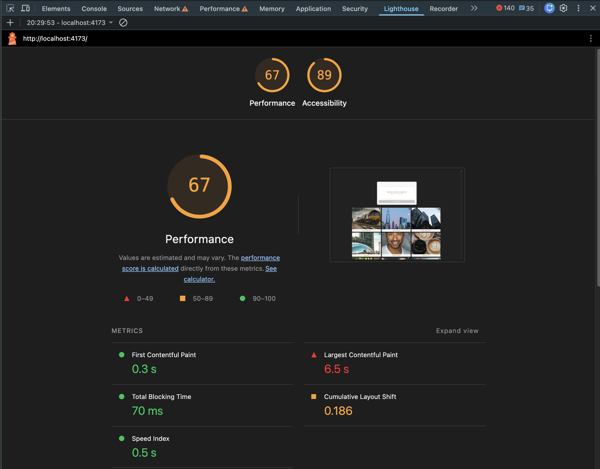
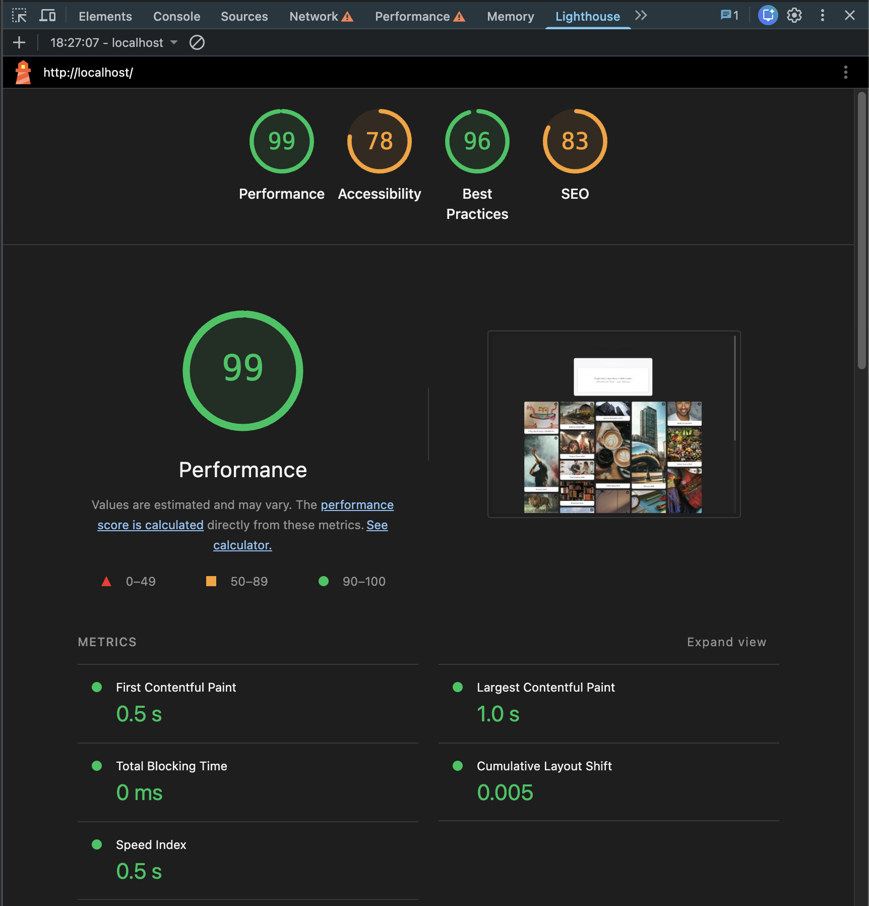
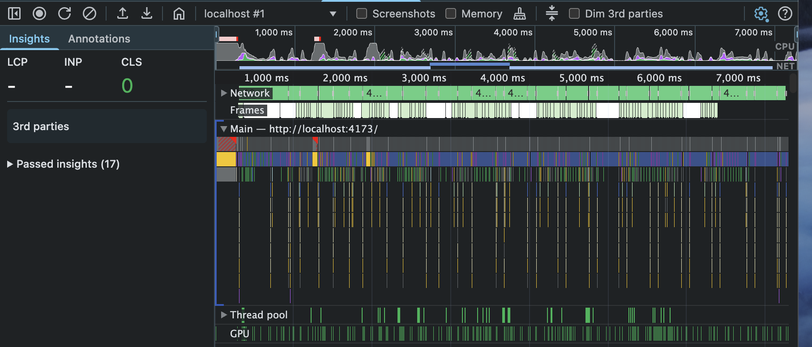
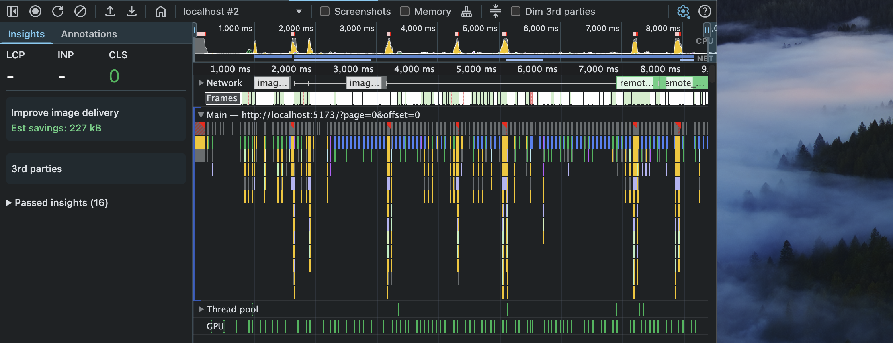

Updated docker commands:

`docker compose -f docker-compose.prod.yml up -d --build # prod on :80
docker compose -f docker-compose.prod.yml down

docker compose up -d # dev on :5173`

# Download times

Several changes were made:

- Load thumbnails instead of full images,
- Only load in 20 images chunks,
- Cache the images and thumbnails,
- Production mode

## Metrics

The download times are dramatically improved, going from 4 seconds to 1 second (slow 4G, CPU slowed down 4x).

The scrolling is still smooth in both cases, but a bit more demanding in the new version (since the images aren't build on landing.)

## Thumbnails

### Handling existing images

We currently have a fair amount of images without thumbnails (\* assuming here that the unsplash images are "pretend" images that have been upload by users, not actual unsplash images). Those images should have thumbnails to make the current experience immediately better.

Selected option: a migration script rather than re-generating on first request. We only have 2k images, which makes the script fast enough, and avoids striking a random user with mass-generation as they scroll. Also, this allows us to run the generation on low usage times rather than randomly.

### Thumbnail size

Width 300px width, the thumbnails will look a bit lower quality on Retina screens. If we want to handle those use case, we could increase the size for bigger resolution and accept slower loading times. Given that the app is picto share rather than a portfolio app, we assumed that the loading speed mattered more than high quality visuals on Retina.

### Production mode

The docker file didn't handle production mode yet, this has been added.

### Cache

The images weren't cached, they are cached now.

# Masonry layout

The height and width of each image is determined during the upload and sent to the client via the API. Each image is assigned a column to avoid layout shifts, which causes uneven columns. It would be possible to strive for more balanced columns while keeping the asigned col, but we determined that the current improvement was already a good start while leaving room for more changed.

## Scroll stability

Since we're handling different image sizes, the new height/width properties are used to build the visual structure before images are loaded.

## Navigating back and forth

The page and image are stored in the URL, which allows us to change the layout if needed without breaking the URL patterns (so users' bookmarks and shared links keep working.) This means that scrolling halfway through an image will refresh on top of the image, and not exactly where the person was.

# Upload

## New component

After scrolling, the upload form isn't visible anymore and it's impossible to track running uploads. There is therefore a floating component allowing both to upload more files and track currently uploaded files. The existing component has been left as is, with the assumption that it's front and center to encourage users to upload (put the emphasis on upload rather than image consulting.)

## Dropped preview

For convenience and especially for mass uploads, validating each image isn't hugely practical. The validation step has been removed and the image is uploaded immediately.

## Resuming uploads

For uploads interrupted with reload or navigating away, the status is stored in the local storage, and the download resumes when returning.

# Refactoring

While the app is basically fine, it lacked several strutcural elements:

- Added a tsconfig file for proper ts project management
- Added a gitignore file to exclude python cache
- Reorganized the main component in logical hooks and components
- Added a Claude.md for basic context
- Added a prod docker for js minification and loading times
- Moved styles to tailwind (chosen for a good balance of performance and clarity)

There is still room for improvements (aliases, biome, storybook...) but those seem more optional.

## Visual refactoring

The app had a dark background, unlike the app in the main branch. Given the colors (header being dark), it seemed like a bug, so we changed it to match.

# Time and priorities

While I didn't fit all the changes in the imparted time (1.5h), I decided to cover the basic required features. The architectural changes, while not asked for and not visible, are important for maintenance and clarity, and worth fitting when they're needed.

That said, some features were skipped:

## Transitions

The bottom component doesn't have transitions and looks basic. With more time, I would have polished it more. The interactions are also minimalistic. Same for the images: with more time, I'd have preloaded a mini-thumbnail with high blur to avoid having blank rectangles.

## Bonus

While Playwright has real value to avoid regressions, the other two are expanding on the scope. For the video, it would need to generate a clean thumbnail via canvas, and play with the video tag inline. For the toggle, while the feature is simple, it can cause some side-effects that would need to be tested cleanly. So Playwright was the only one covered.
